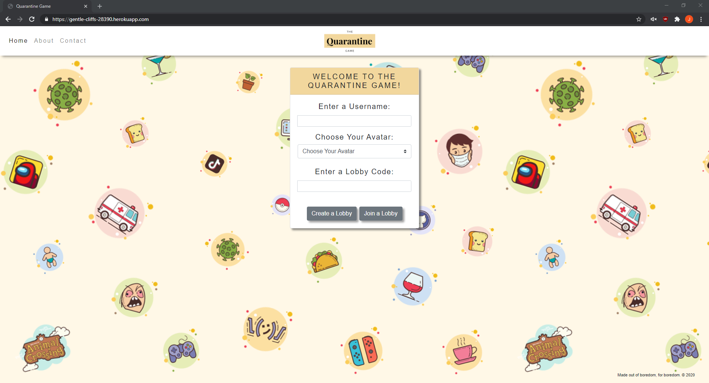
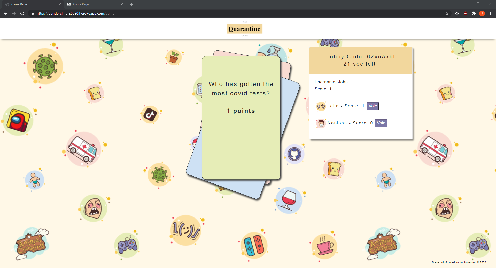

# Quarantine Game
  
  # Table of Contents
1. [About](#description)
2. [Instructions](#instructions)
3. [Demo](#installation)
4. [Screenshots](#screenshots)
5. [License](#license)
6. [Team](#team)
## About
* Tired of lockdowns and social distancing? Looking for a new source of entertainment and a way to virtually interact with friends? Well, you've come to the right place.

* The Quarantine Game is the newest way to fill this endless void with a little bit of joy.
The 2020 card game, made to enjoy with others virtually.

* Simply grab your favorite beverage, hop on a video chat with some friends, and let the fun begin!
## Instructions
* Before beginning a game, each user must enter a username and select an avatar.

* If your friends have already started a lobby, enter the code to join them. If you’re still waiting to make friends, create a lobby of your own and invite up to 8 friendly prospects.

* The game creator will have the option to choose how many rounds you’ll play, and the consequence for the winner of each round. Our recommended consequences are sips or shots of your favorite adult beverage.

* Once the game begins, all players will have 30 seconds to vote for the player of your choice. The player who receives the most votes will incur the consequence!
## Demo
* Deployed at: [https://gentle-cliffs-28390.herokuapp.com/](https://gentle-cliffs-28390.herokuapp.com/)
## Screenshots

## License
* A short and simple permissive license with conditions only requiring preservation of copyright and license notices. Licensed works, modifications, and larger works may be distributed under different terms and without source code.
## Team
* Cathlene Converse
    * Email: cathleneconverse@gmail.com
    * Github: https://github.com/cgconverse
* Tammy Nguyen
    * Email: tammyn137@gmail.com
    * Github: https://github.com/ttngu
* Tito Rivera
    * Email: titorivera0707@gmail.com
    * Github: https://github.com/titorivera0707
* John Westermeyer
    * Email: johnwestermeyer@gmail.com
    * Github: https://github.com/johnwestermeyer